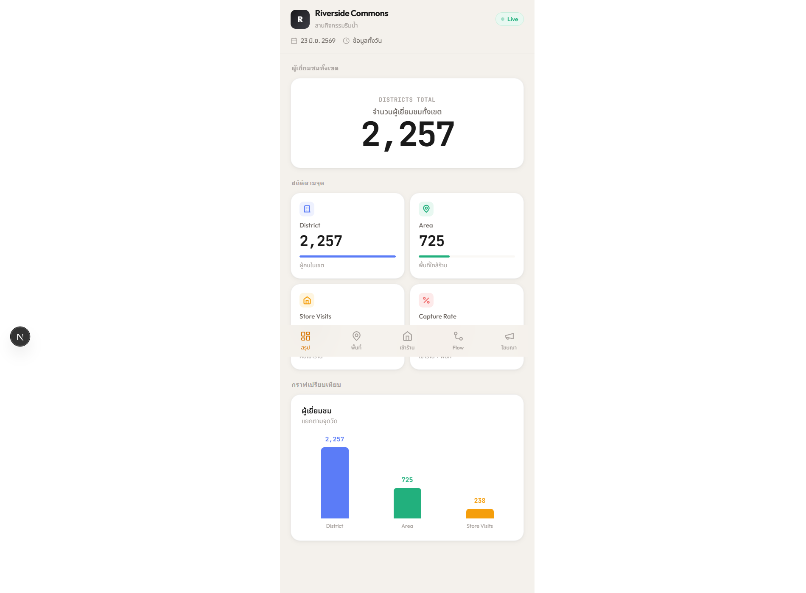
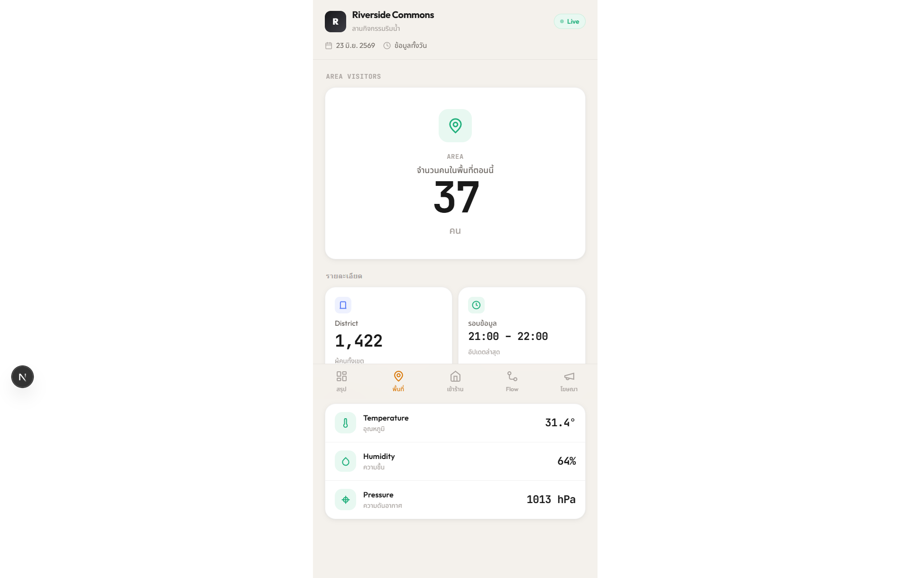
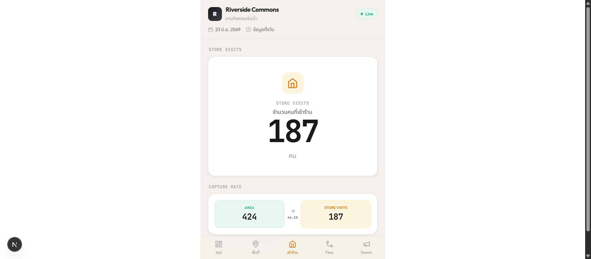
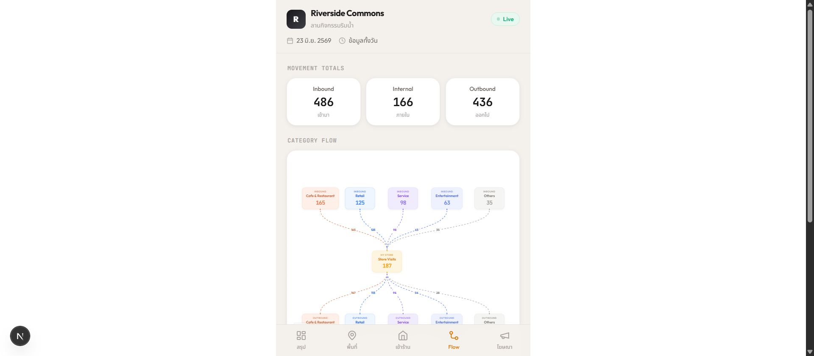
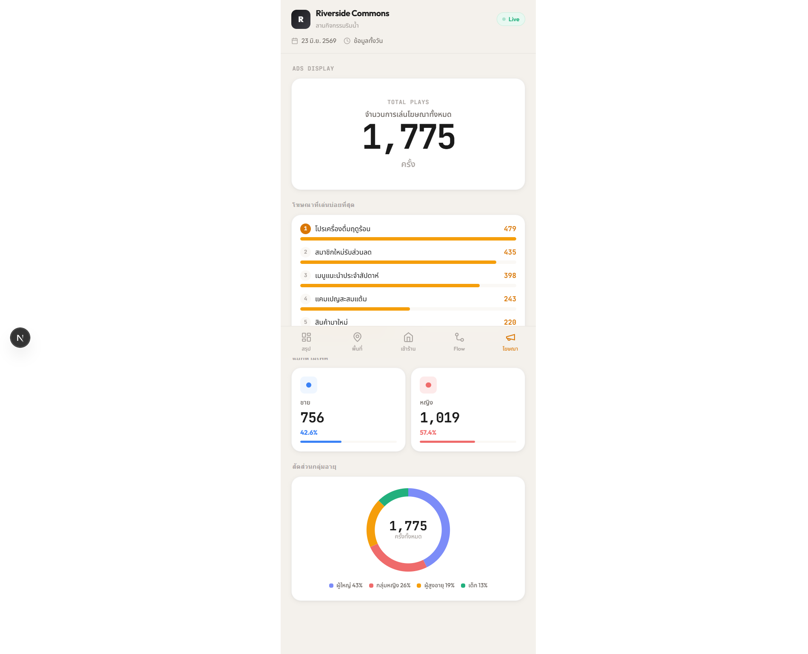
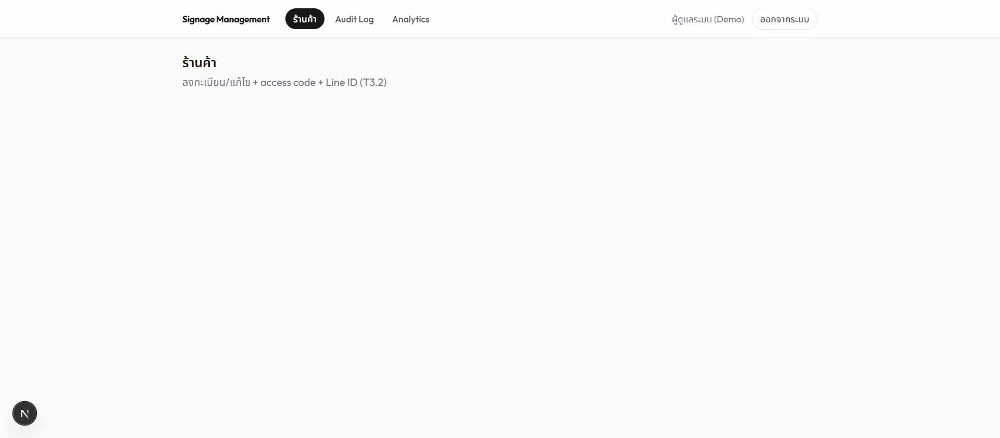
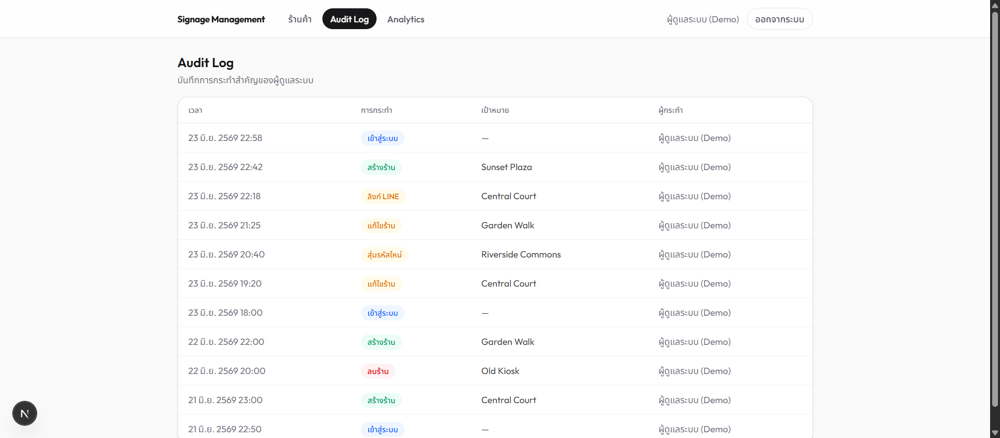
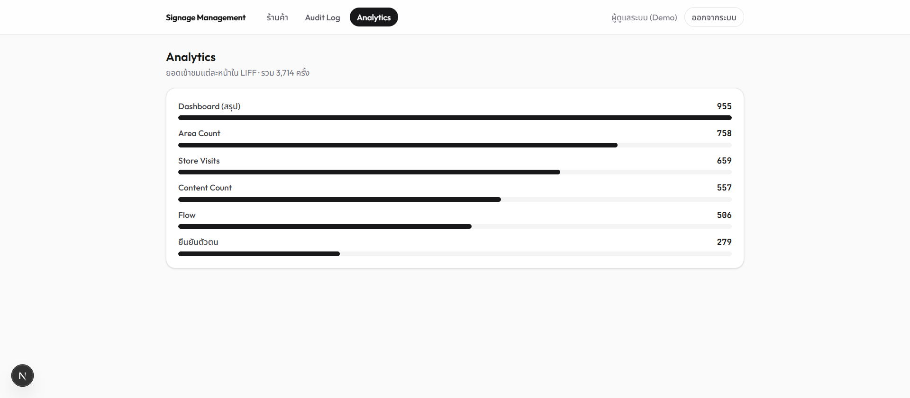

# Smart Signage — Line-LIFF Analytics (Portfolio Demo)

แพลตฟอร์มสถิติ **Smart Signage** สองส่วน: **Dashboard บนมือถือผ่าน LINE LIFF**
สำหรับเจ้าของร้านดูสถิติ และ **ระบบหลังบ้าน (Management)** สำหรับผู้ดูแลจัดการร้านค้า

> 🧪 **Portfolio demo — ข้อมูลจำลองทั้งหมด (mock) ไม่มีข้อมูลบริษัทจริงแม้แต่จุดเดียว**
> สร้างใหม่จากระบบงานจริงที่โค้ดซับซ้อน เพื่อให้กดเล่นได้ทันทีและ company-safe

🔗 **Live demo:** _(เพิ่มลิงก์หลัง deploy)_ · **GitHub:** _(เพิ่มลิงก์ของคุณ)_

---

## ปัญหา

ระบบ Smart Signage เดิมผูกกับ sensor / API / ฐานข้อมูลของบริษัท — เอามาโชว์เป็น
ผลงานไม่ได้เพราะมีข้อมูลลับและกดเล่นไม่ได้ถ้าไม่มี credential จริง

**เป้าหมาย:** สร้างเวอร์ชันใหม่ที่
- กดเล่นได้ทันที ไม่มี login wall (มีโหมด demo)
- ใช้ข้อมูลจำลองที่ "รู้สึกเหมือนจริง" แทน API บริษัท
- สลับไปต่อ backend จริงได้ด้วย env เดียว (พิสูจน์ว่าทำ full-stack ได้)

## Tech Stack

| ด้าน | เทคโนโลยี |
|------|-----------|
| Framework | **Next.js 16** (App Router, React 19, Server Actions, Turbopack) |
| Database | **Cloudflare D1** (SQLite) + **Drizzle ORM** |
| Deploy | **Cloudflare Workers** ผ่าน `@opennextjs/cloudflare` (OpenNext) |
| Diagram | **@xyflow/react** v12 (React Flow) |
| Styling | **Tailwind CSS v4** + custom design tokens · ฟอนต์ Outfit / JetBrains Mono / Noto Sans Thai |
| Auth | Email+password เอง — PBKDF2 (Web Crypto) + signed HMAC session cookie |

## ฟีเจอร์

### 📱 Dashboard LIFF (มือถือ)
ยืนยันตัวตนด้วย **เบอร์ร้าน + access code** (หรือกดโหมด demo) แล้วเข้า 5 หน้า:

- **Dashboard** — สรุปเมื่อวาน: funnel District → Area → Store Visits + Capture Rate + กราฟเปรียบเทียบ
- **Area Count** — จำนวนคนในพื้นที่รายชั่วโมง + ข้อมูลเซนเซอร์ (อุณหภูมิ/ความชื้น/ความดัน)
- **Store Visits** — จำนวนคนเข้าร้าน + Capture Rate (Area → Store Visits)
- **Flow** — แผนผังการเดินทางฝูงชน (React Flow) แยกตามหมวดร้าน inbound/outbound
- **Content Count** — โฆษณาที่เล่นบ่อยสุด + สัดส่วนเพศ/อายุ (donut)

### 🖥️ Management (หลังบ้าน)
- ระบบ login (email+password)
- ลงทะเบียน/แก้ไข/ลบร้าน + **สร้าง access code อัตโนมัติ** + ลิงก์ LINE ID
- **Audit log** บันทึกทุก action สำคัญ
- **Analytics** ยอดเข้าชมแต่ละหน้าใน LIFF

## Architecture

```
app/
  (liff)/      มือถือ — verify + (app)/{dashboard,area,store-visits,flow,content}
  admin/       หลังบ้าน — login + (panel)/{stores,audit,analytics}
lib/
  db/          Drizzle schema (11 ตาราง) + D1 client
  mock/        deterministic generator (seed = storeId+date) + demo registry
  data/        ⭐ data layer เดียว — env-toggle: DATA_SOURCE=real → D1 / ไม่ตั้ง → mock
  auth/        PBKDF2 + signed session + guard
```

**หัวใจคือ data layer + env-toggle:** ทุกหน้าอ่านผ่าน `getSource()` ตัวเดียว
ไม่มี component ไหนแตะ D1 ตรง ๆ → สลับ mock ↔ real ได้โดยไม่แก้ UI และ
`npm run build` ผ่านโดยไม่ต้องมี secret ใด ๆ

**Mock ที่สมจริง:** PRNG แบบ deterministic (cyrb53 → mulberry32) จาก seed `storeId:date`
→ funnel มีลำดับเหตุผล, conversion สมจริง, peak hour โค้งธรรมชาติ, รีเฟรชแล้วค่าคงเดิม

## Screenshots

| Dashboard | Area Count | Store Visits |
|---|---|---|
|  |  |  |

| Flow (React Flow) | Content Count | Management — ร้านค้า |
|---|---|---|
|  |  |  |

| Audit Log | Analytics |
|---|---|
|  |  |

## รันในเครื่อง

```bash
npm install
npm run dev          # http://localhost:3000  (โหมด mock เป็นค่าเริ่มต้น ไม่ต้องมี DB)
```

**ทดลองใช้:**
- LIFF: เปิด `/` → "เปิด Dashboard LIFF" → กด **เข้าชมด้วยร้านตัวอย่าง**
- Management: `/admin/login` → `admin@demo.local` / `demo1234`

```bash
npm run build        # production build (ผ่านโดยไม่ต้องมี secret)
npm run lint
npm run db:generate  # สร้าง migration จาก schema
```

## ต่อ backend จริง (Cloudflare D1)

ตั้ง `DATA_SOURCE=real` + ค่าใน `.env.local` (ดู `.env.example`) แล้ว migrate ขึ้น D1 —
data layer จะอ่านจาก D1 แทน mock ทันที โดย UI ไม่ต้องเปลี่ยน
Deploy บน Cloudflare Workers ด้วย `@opennextjs/cloudflare` และ seed ข้อมูลรายวันด้วย Cron Triggers

## Company-safe

- ข้อมูลทั้งหมดเป็น mock · ชื่อร้าน/พิกัด/อีเมลเป็นของสมมติ
- credential ที่โชว์ = ของปลอมที่ตั้งใจให้ public
- `.env*` อยู่ใน `.gitignore` · build ไม่ต้องใช้ secret
